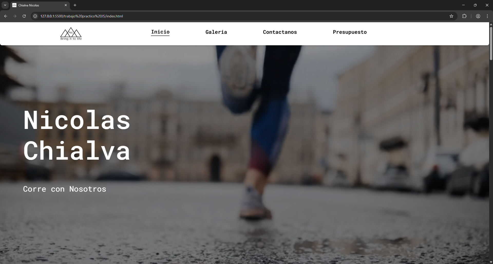
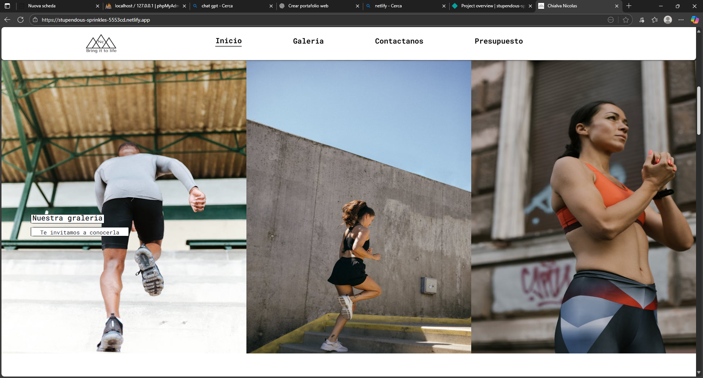
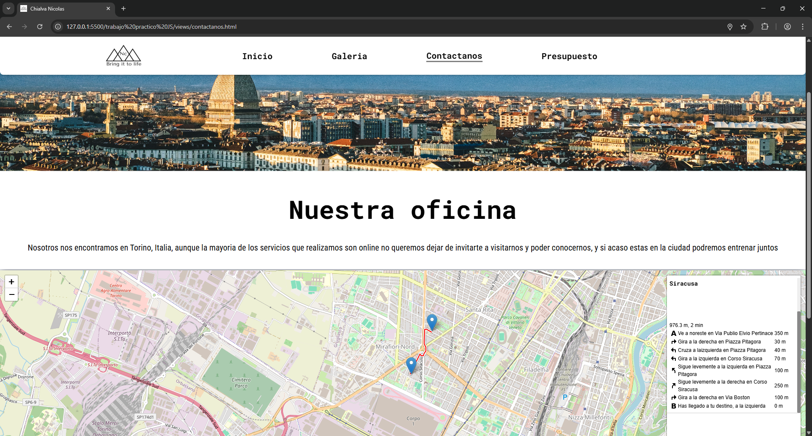
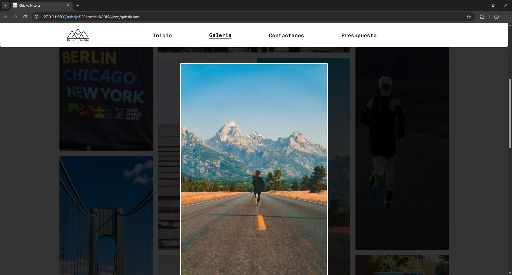
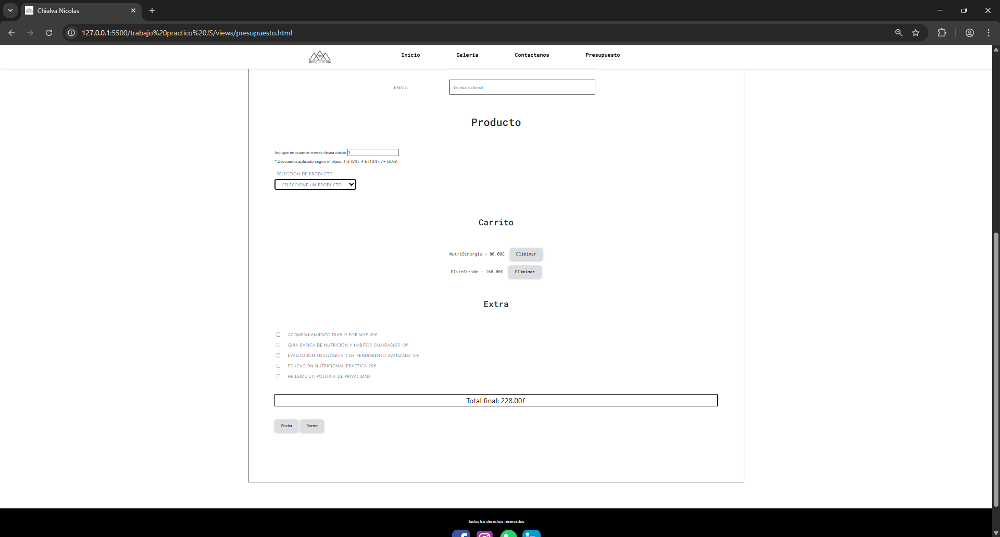

📌 Progetto JS - Lavoro Pratico
📄 Descrizione

Questo progetto consiste in una piattaforma web interattiva e dinamica sviluppata con HTML, CSS, JavaScript, Node.js ed MongoDB.
L’applicazione offre funzionalità avanzate come gestione del carrello, invio di dati al database, visualizzazione dinamica con Lightbox, integrazione di PDF scaricabili, e contenuti caricati tramite JSON.

L’obiettivo è fornire un sito moderno, funzionale e professionale, simulando un vero servizio di consulenza, nutrizione e allenamento personalizzato.

🏠 Homepage

La pagina iniziale introduce l’utente ai principali servizi offerti, attraverso sezioni informative, immagini, un video introduttivo e collegamenti rapidi alle altre aree del sito.
Inoltre, alcuni contenuti vengono caricati dinamicamente tramite un file JSON, come informazioni su eventi e competizioni.

📩 Sezione Contatti

In questa sezione gli utenti possono compilare un modulo per inviare richieste o domande.
I dati vengono inviati tramite Node.js e salvati in modo sicuro in MongoDB, permettendo la gestione e conservazione delle richieste in modo professionale.

🖼️ Galleria Immagini

L’area galleria offre una visualizzazione elegante e dinamica delle immagini tramite Lightbox, che consente all’utente di aprire, ingrandire e scorrere le immagini in modalità interattiva.

🛒 Sezione Prodotti e Carrello

In questa sezione l’utente può:
📝 Visualizzare e selezionare diversi piani e servizi
📎 Scaricare i dettagli in PDF per ogni offerta
➕ Aggiungere prodotti ed extra al carrello dinamico
🧮 Visualizzare totale aggiornato in tempo reale
🗑️ Rimuovere prodotti individualmente

Carrello interattivo sviluppato in JavaScript con gestione frontend e logica lato client.

 

⚙️ Funzionalità Principali

✔ Struttura HTML semantica e ottimizzata
✔ Styling moderno e responsivo con CSS e Bootstrap
✔ Interattività dinamica con JavaScript (ES6+)
✔ Backend con Node.js e Express
✔ Salvataggio dati utenti in MongoDB
✔ Caricamento dinamico di contenuti da JSON
✔ Download di PDF personalizzati
✔ Gestione del carrello in tempo reale

🛠️ Tecnologie Utilizzate
Tecnologia	Descrizione
🖥️ HTML5	Struttura semantica e accessibile
🎨 CSS3	Styling moderno e responsive
⚙️ JavaScript ES6+	Interattività dinamica e logica frontend
🌐 Node.js	Backend e gestione server
🚏 Express.js	Routing e API REST
🗄️ MongoDB	Database per salvataggio dei dati
💡 Lightbox	Visualizzazione dinamica immagini
📄 PDF Download	Dettagli prodotti scaricabili
📦 Bootstrap	Supporto al layout responsive
